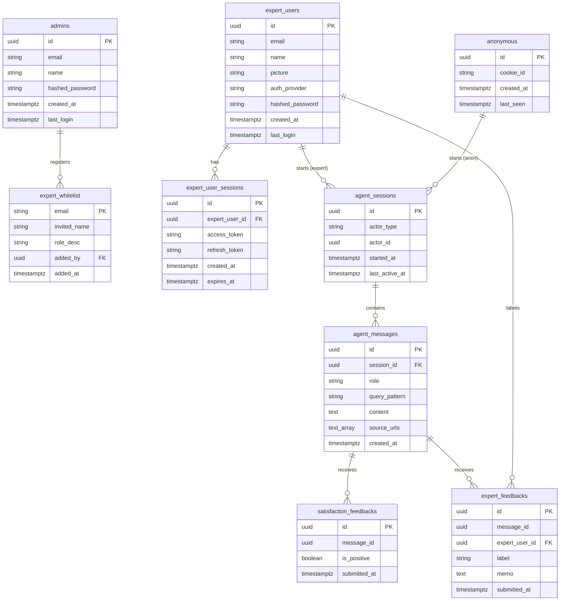

# MFDS Backend ERD (Database Schema Specification)

이 문서는 백엔드 시스템(`SQLAlchemy` 및 `SQLModel`)의 실제 테이블과 외래키 관계를 바탕으로 정리된 핵심 ERD 사양서입니다. 

우리가 관리하는 3대 주체인 **비회원(anonymous)**, **전문가회원(expert_users)**, **관리자(admins)** 및 이들의 활동과 관련된 9개의 핵심 테이블로 구성되어 있습니다. (코드 상에 존재하는 일반 회원/비즈니스 및 캐시 관련 레거시/보일러플레이트 테이블들은 제외되었습니다.)

---

## 1. 관계 다이어그램 (ERD)

---

## 2. 핵심 테이블 상세 정보

* **`admins`**: 시스템 운영자 계정 정보 테이블
* **`expert_whitelist`**: 어드민이 사전에 등록해 둔 가입 허용 전문가 이메일 목록
* **`expert_users`**: 화이트리스트 확인 후 가입한 공인 전문가 계정 정보 테이블
* **`expert_user_sessions`**: 전문가 세션 인증 정보 테이블
* **`anonymous`**: 전문가 챗봇용 비식별 브라우저 세션 정보 테이블
* **`agent_sessions`**: 전문가/비식별 사용자별 대화 세션 정보 테이블 (다형성 actor 구조)
* **`agent_messages`**: 에이전트 대화 내 개별 발화 내용 기록
* **`satisfaction_feedbacks`**: 일반 만족도 추천(👍/👎) 정보로, `agent_messages` 피드백을 수집
* **`expert_feedbacks`**: 공인 전문가가 답변 메시지(`agent_messages`)에 대해 남긴 정확성 검증 라벨 및 수정 조언 기록
