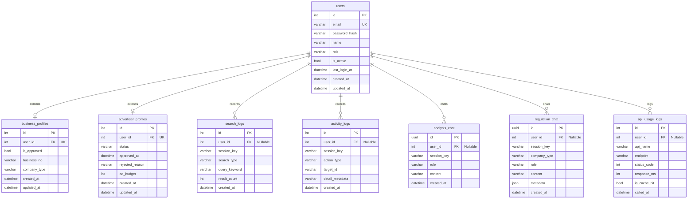

# MFDS ERD

Mermaid `erDiagram`은 속성·관계 라벨의 **따옴표·괄호·슬래시** 등에서 파싱 오류가 발생할 수 있습니다. 필드 설명은 하단의 표를 참고해 주세요.

## 관계

| 관계 | 설명 |
|------|------|
| users → business_profiles | 1:0..1, 상속/확장 (기업 회원 프로필, `user_id` → `users.id` 참조) |
| users → advertiser_profiles | 1:0..1, 상속/확장 (광고 회원 프로필, `user_id` → `users.id` 참조) |
| users → search_logs | 1:N, 검색 기록 로깅 (비식별 관계, 비로그인 시 `user_id`는 Null) |
| users → activity_logs | 1:N, 상세 조회 클릭 행동 로깅 (비식별 관계, 비로그인 시 `user_id`는 Null) |
| users → analysis_chat | 1:N, AI 분석 채팅 메시지 기록 (비식별 관계, 비로그인 시 `user_id`는 Null) |
| users → regulation_chat | 1:N, AI 법규 채팅 메시지 기록 (비식별 관계, 비로그인 시 `user_id`는 Null) |
| users → api_usage_logs | 1:N, 외부 API 사용 기록 (비식별 관계, 비로그인 시 `user_id`는 Null) |

## 필드 설명

| 엔티티 | 필드 | 설명 |
|--------|------|------|
| **users** | id | 회원 ID (고유 대리 식별자) |
| **users** | email | 회원 이메일 (고유 자격증명 정보) |
| **users** | password_hash | Bcrypt 등으로 암호화된 비밀번호 해시값 |
| **users** | name | 회원 실명 혹은 관리자명 |
| **users** | role | 회원 역할 권한 (`user` \| `business` \| `advertiser` \| `admin`) |
| **users** | is_active | 계정 활성화 상태 유무 (어드민에 의해 제어 가능) |
| **users** | last_login_at | 최근 로그인 일시 |
| **users** | created_at | 계정 생성 일시 |
| **users** | updated_at | 계정 정보 최근 수정 일시 |
| **business_profiles** | user_id | users.id 참조 (1:1 고유 외래키 관계) |
| **business_profiles** | is_approved | 기업 회원 승인 유무 (어드민 검토 대상) |
| **business_profiles** | business_no | 사업자 등록번호 (최대 64자) |
| **business_profiles** | company_type | 업태 및 회사 종류 (최대 128자) |
| **advertiser_profiles** | user_id | users.id 참조 (1:1 고유 외래키 관계) |
| **advertiser_profiles** | status | 광고주 승인 진행 상태 (`pending` \| `approved` \| `rejected`) |
| **advertiser_profiles** | approved_at | 광고주 권한 최종 승인 일시 |
| **advertiser_profiles** | rejected_reason | 광고 승인 거절 시 사유 |
| **advertiser_profiles** | ad_budget | 설정한 일일/월간 광고 예산 범위 |
| **search_logs** | user_id | 검색을 요청한 users.id (비로그인 검색 시 Null 허용) |
| **search_logs** | session_key | 익명 통계 집계를 위한 세션 키 |
| **search_logs** | search_type | 검색 도메인 분류 (`recall` \| `enforcement` \| `supplier`) |
| **search_logs** | query_keyword | 사용자가 입력한 검색어 |
| **search_logs** | result_count | 검색된 결과 레코드 개수 |
| **activity_logs** | user_id | 행동한 users.id (비로그인 활동 시 Null 허용) |
| **activity_logs** | session_key | 익명 행동 추적을 위한 세션 식별자 |
| **activity_logs** | action_type | 상세 유형 (`view_recall` \| `view_enforcement` \| `view_supplier` \| `click_ad`) |
| **activity_logs** | target_id | 클릭한 상세 제품 ID 혹은 타겟 식별자 |
| **activity_logs** | detail_metadata | 직렬화된 부가 데이터 정보 (JSON 형식) |
| **analysis_chat** | id | 대화 메시지 식별용 UUID |
| **analysis_chat** | user_id | 채팅을 나눈 users.id (비로그인 이용 시 Null 허용) |
| **analysis_chat** | session_key | 비로그인 대화 유지용 세션 키 |
| **analysis_chat** | role | 발화 주체 (`user` \| `assistant`) |
| **analysis_chat** | content | 채팅 메시지 본문 텍스트 (TEXT 타입) |
| **regulation_chat** | id | 대화 메시지 식별용 UUID |
| **regulation_chat** | user_id | 채팅을 나눈 users.id (비로그인 이용 시 Null 허용) |
| **regulation_chat** | session_key | 비로그인 대화 유지용 세션 키 |
| **regulation_chat** | company_type | 기업 사용자가 입력한 비즈니스 종류 |
| **regulation_chat** | role | 발화 주체 (`user` \| `assistant`) |
| **regulation_chat** | content | 채팅 메시지 본문 텍스트 (TEXT 타입) |
| **regulation_chat** | message_metadata | Gemini 답변의 근거가 된 출처 정보 (JSON 타입) |
| **api_usage_logs** | user_id | API 호출을 유도한 users.id (Null 허용) |
| **api_usage_logs** | api_name | 호출한 공공 Open API 명칭 (식품안전나라 등) |
| **api_usage_logs** | endpoint | API 상세 호출 경로 (엔드포인트) |
| **api_usage_logs** | status_code | 외부 API 서버로부터 반환받은 HTTP 응답 코드 |
| **api_usage_logs** | response_ms | API 응답 소요 시간 (밀리초 단위) |
| **api_usage_logs** | is_cache_hit | 내부 디스크/DB 캐시 적중 성공 유무 |
